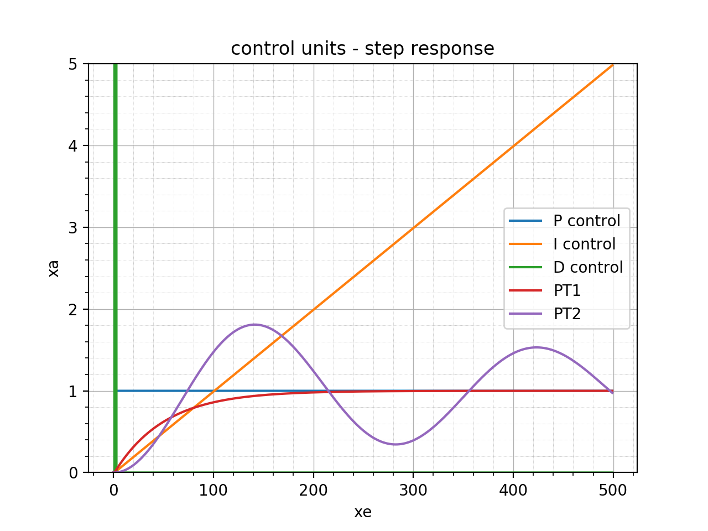

# PyConSys
Control System with Python and Artificial Intelligence (Evolutionary Algorithm)

Control units and control loops implemented in Excel and Python (Python with AI example). In Python, PID parameters can be set automatically. Excel file with numeric basics included.

From the course "Mechatronische Systeme (Mechatronic Systems)" and "Künstliche Intelligenz (Artificial Intelligence)", technical college SBS Herzogenaurach-Höchstadt.

**Step responses with different control units:**

**PT2 - PID control loop with PID parameters set by the software:**

**PT2 - PID control loop with manually set PID parameters:**

___________________________________________________________________________________________

Regelungstechnik mit Python und Künstlicher Intelligenz (Evolutionäre Algorithmen)

Implementierung der Regelglieder und Regelkreise in Excel und Python (Python auch mit Künstlicher Intelligenz). PID Parameter können mit Python automatisch ermittelt werden. Eine Excel-Datei zur Veranschaulichung der Numerik liegt bei.

Aus dem Unterricht "Mechatronische Systeme" und "Künstliche Intelligenz" an der Fachschule für Maschinenbautechnik und Mechatroniktechnik, SBS Herzogenaurach-Höchstadt.

___________________________________________________________________________________________

This Source Code Form is subject to the terms of the Mozilla Public
License, v. 2.0. If a copy of the MPL was not distributed with this
file, You can obtain one at https://mozilla.org/MPL/2.0/.

(c) 2020, Metin Karatas (m.karatas@sbs-herzogenaurach.de)

